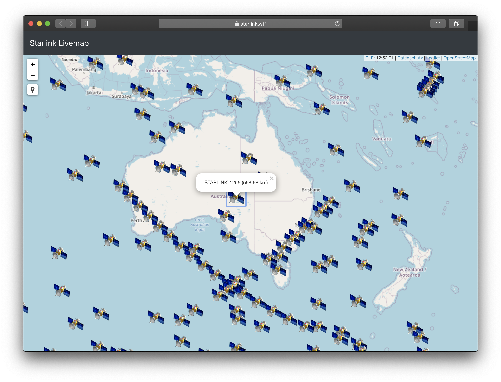

# Starlink Livemap 
This project aims to display the likely location of all Starlink satellites on a live map. It currently does the following things:
- Get latest TLEs of Starlink satellites via cronjob
- Parse and transform TLEs to useable lat/ lng via [satellite.js](https://github.com/shashwatak/satellite-js)
- Display current (likely) location of Starlink satellites on a [Leaflet](https://leafletjs.com) map 
- Display the orbit of a Starlink satellite
- Get and display current [user location](https://github.com/domoritz/leaflet-locatecontrol)

This project is still in a young stage and a lot of optimazation has to happen! Possible new things for the future:
- Vue.js (?)
- Visibility
- ...
